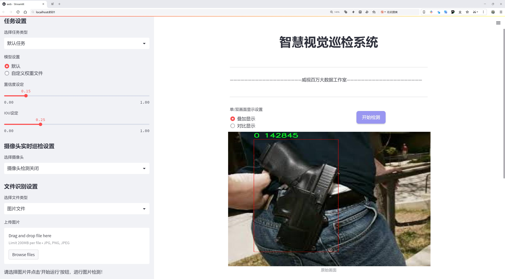
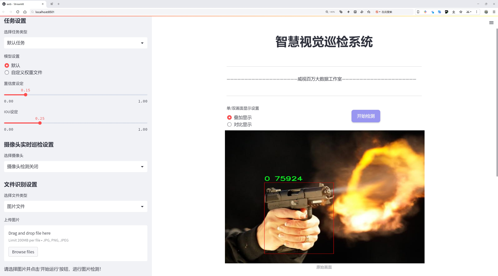
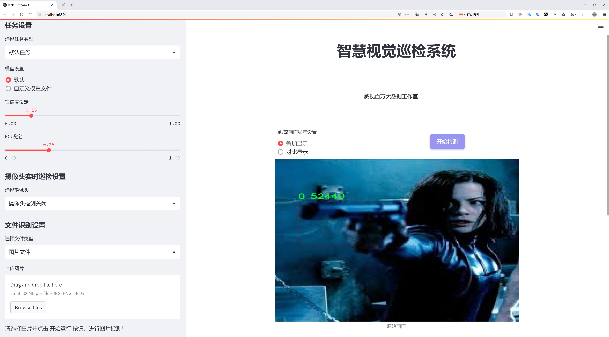
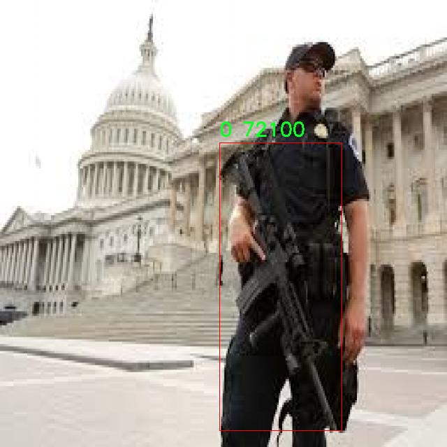
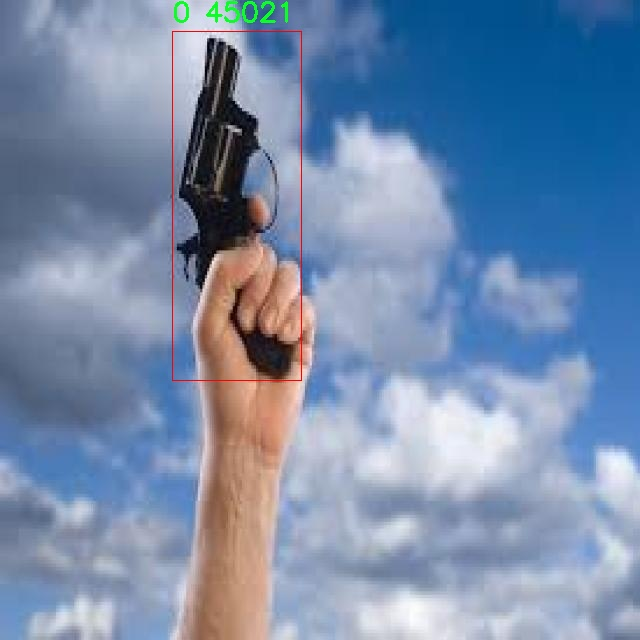
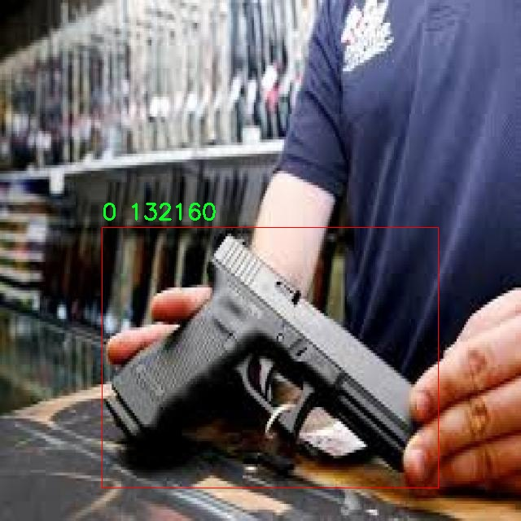
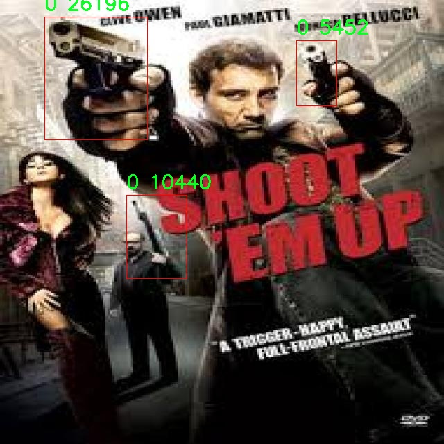

# 军事武器检测检测系统源码分享
 # [一条龙教学YOLOV8标注好的数据集一键训练_70+全套改进创新点发刊_Web前端展示]

### 1.研究背景与意义

项目参考[AAAI Association for the Advancement of Artificial Intelligence](https://gitee.com/qunmasj/projects)

项目来源[AACV Association for the Advancement of Computer Vision](https://kdocs.cn/l/cszuIiCKVNis)

研究背景与意义

随着科技的迅猛发展，军事领域的现代化进程不断加快，武器装备的种类和数量日益增加，如何有效地进行武器检测与识别成为当前军事安全的重要课题。传统的武器检测方法多依赖于人工监控和经验判断，效率低下且容易受到人为因素的影响，难以满足现代战争中对快速反应和高精度的要求。因此，基于计算机视觉和深度学习技术的自动化武器检测系统应运而生，成为提升军事侦察和监控能力的重要手段。

YOLO（You Only Look Once）系列模型以其实时性和高准确率在目标检测领域取得了显著的成果。YOLOv8作为该系列的最新版本，进一步优化了检测速度和精度，适用于复杂环境下的目标识别任务。然而，尽管YOLOv8在一般场景下表现优异，但在特定的军事应用中，仍然面临着诸多挑战，例如背景复杂性、光照变化、目标遮挡等问题。因此，针对军事武器检测的需求，对YOLOv8进行改进，以提升其在特定环境下的检测性能，具有重要的理论和实践意义。

本研究将基于Weapons_v2数据集进行YOLOv8模型的改进与训练。该数据集包含3566张图像，涵盖了两类武器目标，具有较高的代表性和多样性。通过对该数据集的深入分析，我们可以识别出不同武器在各种环境下的特征，从而为模型的优化提供依据。数据集的构建和标注过程也为后续的研究提供了可靠的数据基础，使得研究成果能够在实际应用中得到验证。

在军事武器检测系统的构建中，改进YOLOv8模型的意义不仅在于提升检测精度和速度，更在于增强系统的鲁棒性和适应性。通过引入数据增强、迁移学习等技术手段，可以有效提高模型在不同场景下的泛化能力，确保其在实际应用中的可靠性。此外，改进后的系统还能够实现对武器目标的实时监控与识别，为军事决策提供有力支持，进而提升作战效率和安全性。

综上所述，基于改进YOLOv8的军事武器检测系统的研究，不仅能够推动目标检测技术在军事领域的应用进程，也为相关技术的进一步发展提供了新的思路和方向。通过系统的研究与实践，我们期望能够为现代军事安全提供更加高效、智能的解决方案，为国家安全和防务建设贡献力量。

### 2.图片演示







##### 注意：由于此博客编辑较早，上面“2.图片演示”和“3.视频演示”展示的系统图片或者视频可能为老版本，新版本在老版本的基础上升级如下：（实际效果以升级的新版本为准）

  （1）适配了YOLOV8的“目标检测”模型和“实例分割”模型，通过加载相应的权重（.pt）文件即可自适应加载模型。

  （2）支持“图片识别”、“视频识别”、“摄像头实时识别”三种识别模式。

  （3）支持“图片识别”、“视频识别”、“摄像头实时识别”三种识别结果保存导出，解决手动导出（容易卡顿出现爆内存）存在的问题，识别完自动保存结果并导出到tempDir中。

  （4）支持Web前端系统中的标题、背景图等自定义修改，后面提供修改教程。

  另外本项目提供训练的数据集和训练教程,暂不提供权重文件（best.pt）,需要您按照教程进行训练后实现图片演示和Web前端界面演示的效果。

### 3.视频演示

[3.1 视频演示](https://www.bilibili.com/video/BV1V8xweHEov/)

### 4.数据集信息展示

##### 4.1 本项目数据集详细数据（类别数＆类别名）

nc: 2
names: ['0', '1']


##### 4.2 本项目数据集信息介绍

数据集信息展示

在现代军事领域，武器检测技术的迅速发展为战场监控和安全保障提供了强有力的支持。为了提升武器检测系统的准确性和效率，本研究采用了名为“Weapons_v2”的数据集，旨在改进YOLOv8模型在军事武器检测中的应用效果。该数据集专门设计用于训练和评估深度学习模型，尤其是针对复杂环境下的武器识别任务。

“Weapons_v2”数据集包含了丰富的军事武器图像，经过精心标注，确保了数据的高质量和高可靠性。该数据集的类别数量为2，分别标记为“0”和“1”，这两个类别代表了不同类型的军事武器。尽管类别数量相对较少，但每个类别内的样本数量和多样性都经过严格筛选，以涵盖各种可能的场景和条件。这种设计使得模型在训练过程中能够学习到更加全面的特征，从而在实际应用中表现出更强的适应性和鲁棒性。

在数据集的构建过程中，研究团队特别关注了图像的多样性和复杂性，确保数据集中的图像涵盖了不同的光照条件、视角和背景。这种多样性不仅提高了模型的泛化能力，还能有效应对实际应用中可能遇到的各种挑战。此外，数据集中的图像还包括了不同环境下的武器，例如城市战斗、野外作战等场景，进一步增强了模型的实用性。

为了确保数据集的有效性和可靠性，所有图像均经过人工审核和标注，确保每个样本的准确性。标注过程中，研究人员使用了先进的标注工具，对每个武器进行精确定位和分类，确保模型在训练时能够获取到准确的标签信息。这种高质量的标注为后续的模型训练和评估奠定了坚实的基础。

在训练过程中，YOLOv8模型将利用“Weapons_v2”数据集进行反复迭代，优化其参数，以提高武器检测的准确率和召回率。通过对比不同训练阶段的模型性能，研究团队能够识别出模型在特定类别上的优势和不足，从而进行针对性的调整和改进。此外，数据集的设计也考虑到了模型的实时性需求，确保训练出的模型能够在实际应用中快速响应，提高军事监控的效率。

总之，“Weapons_v2”数据集不仅为改进YOLOv8的军事武器检测系统提供了丰富的训练素材，也为未来的研究和应用奠定了基础。通过对该数据集的深入分析和应用，研究团队期望能够在武器检测领域取得突破性进展，为军事安全和战场监控提供更为精准和高效的技术支持。










### 5.全套项目环境部署视频教程（零基础手把手教学）

[5.1 环境部署教程链接（零基础手把手教学）](https://www.ixigua.com/7404473917358506534?logTag=c807d0cbc21c0ef59de5)


[5.2 安装Python虚拟环境创建和依赖库安装视频教程链接（零基础手把手教学）](https://www.ixigua.com/7404474678003106304?logTag=1f1041108cd1f708b01a)

### 6.手把手YOLOV8训练视频教程（零基础小白有手就能学会）

[6.1 手把手YOLOV8训练视频教程（零基础小白有手就能学会）](https://www.ixigua.com/7404477157818401292?logTag=d31a2dfd1983c9668658)

### 7.70+种全套YOLOV8创新点代码加载调参视频教程（一键加载写好的改进模型的配置文件）

[7.1 70+种全套YOLOV8创新点代码加载调参视频教程（一键加载写好的改进模型的配置文件）](https://www.ixigua.com/7404478314661806627?logTag=29066f8288e3f4eea3a4)

### 8.70+种全套YOLOV8创新点原理讲解（非科班也可以轻松写刊发刊，V10版本正在科研待更新）

由于篇幅限制，每个创新点的具体原理讲解就不一一展开，具体见下列网址中的创新点对应子项目的技术原理博客网址【Blog】：


[8.1 70+种全套YOLOV8创新点原理讲解链接](https://gitee.com/qunmasj/good)

### 9.系统功能展示（检测对象为举例，实际内容以本项目数据集为准）

图9.1.系统支持检测结果表格显示

  图9.2.系统支持置信度和IOU阈值手动调节

  图9.3.系统支持自定义加载权重文件best.pt(需要你通过步骤5中训练获得)

  图9.4.系统支持摄像头实时识别

  图9.5.系统支持图片识别

  图9.6.系统支持视频识别

  图9.7.系统支持识别结果文件自动保存

  图9.8.系统支持Excel导出检测结果数据


### 10.原始YOLOV8算法原理

原始YOLOv8算法原理

YOLOv8算法作为目标检测领域的最新进展，继承并发展了YOLO系列模型的核心思想，尤其是YOLOv5和YOLOv7的优点。该算法的结构依然遵循输入层、主干网络、特征融合层和解耦头的设计框架，但在多个方面进行了创新和优化，以提升检测性能和效率。

在主干网络部分，YOLOv8采用了CSPDarknet的设计理念，这一设计在YOLOv5中已经得到了广泛应用。与YOLOv5的C3模块相比，YOLOv8引入了C2f模块，这一变化不仅使得网络在保持检测精度的同时实现了轻量化，还增强了特征提取的能力。C2f模块的设计灵感来源于ELAN结构，它通过引入多个shortcut连接，显著缓解了深层网络中的梯度消失问题。C2f模块由多个CBS（卷积+归一化+SiLU激活）模块和若干个Bottleneck组成，通过这种结构，YOLOv8能够有效提取目标的多层次特征信息，并在网络的不同层次之间实现特征的高效重用。

在特征融合层，YOLOv8采用了PAN-FPN（Path Aggregation Network with Feature Pyramid Network）结构，这一结构在YOLOv5的基础上进行了改进，特别是在上采样阶段去掉了1x1卷积，以简化网络并提高特征融合的效率。PAN-FPN通过自下而上的方式将高层特征与中层和浅层特征进行融合，从而实现多尺度信息的有效整合。这种融合方式使得YOLOv8在检测小目标时表现得更加出色，因为它能够充分利用不同层次的特征信息。

值得注意的是，YOLOv8在设计上摒弃了传统的Anchor-Base方法，转而采用了Anchor-Free的思想。这一转变不仅简化了模型的复杂性，还提高了目标检测的灵活性和准确性。Anchor-Free方法通过直接预测目标的边界框，减少了对先验框的依赖，使得模型在处理不同尺寸和形状的目标时更加自适应。

在损失函数的设计上，YOLOv8引入了VFLLoss作为分类损失，并结合DFLLoss和CIoULoss来优化边界框的回归任务。这种组合损失函数的设计使得模型在面对类别不平衡和样本稀缺的情况下，依然能够保持较高的检测精度。特别是在处理小目标时，VFLLoss通过对难以分类的样本给予更高的权重，帮助模型更好地学习这些难点。

YOLOv8的样本匹配策略也经历了重要的改进。由静态匹配转变为Task-Aligned的Assigner匹配方式，使得模型在训练过程中能够更有效地对齐样本与任务目标。这一策略的实施进一步提升了模型的学习效率和准确性，尤其是在复杂场景下的目标检测任务中。

在数据预处理方面，YOLOv8延续了YOLOv5的策略，采用了包括马赛克增强、混合增强、空间扰动和颜色扰动等多种数据增强手段，以提升模型的泛化能力。尽管在某些实验中未启用数据预处理，但其设计理念依然为模型的训练提供了坚实的基础。

YOLOv8的Head部分设计上借鉴了YOLOX和YOLOv6的解耦头结构，取消了objectness分支，通过4*reg_max和num_class两部分进行边框回归和目标分类。这种解耦设计使得分类和回归任务可以独立优化，从而提高了模型的整体性能。Head部分输出的特征图尺度为80x80、40x40和20x20，能够有效捕捉不同尺寸目标的信息，确保模型在多种场景下的适应性。

最后，YOLOv8的多种网络结构（如YOLOv8n、YOLOv8s、YOLOv8m、YOLOv8l和YOLOv8x）为不同应用场景提供了灵活的选择。这些网络结构的主要区别在于Backbone的深度和宽度，以及残差块的数量，使得用户可以根据具体需求选择合适的模型，进一步提升目标检测的效率和效果。

综上所述，YOLOv8通过在网络结构、特征融合、损失函数和样本匹配等多个方面的创新，显著提升了目标检测的性能。其轻量化设计和高效的特征提取能力，使得YOLOv8在实际应用中表现出色，成为目标检测领域的一个重要里程碑。


### 11.项目核心源码讲解（再也不用担心看不懂代码逻辑）

#### 11.1 70+种YOLOv8算法改进源码大全和调试加载训练教程（非必要）\ultralytics\utils\callbacks\hub.py

以下是经过精简和注释的核心代码部分：

```python
# 导入必要的库
import json
from time import time
from ultralytics.hub.utils import HUB_WEB_ROOT, PREFIX, events
from ultralytics.utils import LOGGER, SETTINGS

def on_pretrain_routine_end(trainer):
    """在预训练例程结束时记录信息并启动上传速率限制计时器。"""
    session = getattr(trainer, 'hub_session', None)  # 获取训练器的会话对象
    if session:
        # 记录模型查看链接
        LOGGER.info(f'{PREFIX}View model at {HUB_WEB_ROOT}/models/{session.model_id} 🚀')
        # 初始化计时器
        session.timers = {'metrics': time(), 'ckpt': time()}

def on_fit_epoch_end(trainer):
    """在每个训练周期结束时上传训练进度指标。"""
    session = getattr(trainer, 'hub_session', None)
    if session:
        # 收集训练损失和指标
        all_plots = {**trainer.label_loss_items(trainer.tloss, prefix='train'), **trainer.metrics}
        if trainer.epoch == 0:
            from ultralytics.utils.torch_utils import model_info_for_loggers
            all_plots = {**all_plots, **model_info_for_loggers(trainer)}  # 添加模型信息
        session.metrics_queue[trainer.epoch] = json.dumps(all_plots)  # 将指标存入队列
        # 检查是否可以上传指标
        if time() - session.timers['metrics'] > session.rate_limits['metrics']:
            session.upload_metrics()  # 上传指标
            session.timers['metrics'] = time()  # 重置计时器
            session.metrics_queue = {}  # 清空队列

def on_model_save(trainer):
    """以速率限制的方式保存检查点到Ultralytics HUB。"""
    session = getattr(trainer, 'hub_session', None)
    if session:
        is_best = trainer.best_fitness == trainer.fitness  # 判断当前模型是否为最佳模型
        # 检查是否可以上传检查点
        if time() - session.timers['ckpt'] > session.rate_limits['ckpt']:
            LOGGER.info(f'{PREFIX}Uploading checkpoint {HUB_WEB_ROOT}/models/{session.model_id}')
            session.upload_model(trainer.epoch, trainer.last, is_best)  # 上传模型
            session.timers['ckpt'] = time()  # 重置计时器

def on_train_end(trainer):
    """在训练结束时上传最终模型和指标到Ultralytics HUB。"""
    session = getattr(trainer, 'hub_session', None)
    if session:
        LOGGER.info(f'{PREFIX}Syncing final model...')
        # 上传最终模型和指标
        session.upload_model(trainer.epoch, trainer.best, map=trainer.metrics.get('metrics/mAP50-95(B)', 0), final=True)
        session.alive = False  # 停止心跳
        LOGGER.info(f'{PREFIX}Done ✅\n'
                    f'{PREFIX}View model at {HUB_WEB_ROOT}/models/{session.model_id} 🚀')

# 事件回调字典，根据设置决定是否启用
callbacks = {
    'on_pretrain_routine_end': on_pretrain_routine_end,
    'on_fit_epoch_end': on_fit_epoch_end,
    'on_model_save': on_model_save,
    'on_train_end': on_train_end,
} if SETTINGS['hub'] is True else {}  # 确认是否启用
```

### 代码核心部分说明：
1. **on_pretrain_routine_end**: 记录模型的链接并初始化上传速率限制的计时器。
2. **on_fit_epoch_end**: 在每个训练周期结束时，收集并上传训练损失和指标。
3. **on_model_save**: 在适当的时间间隔内上传模型检查点。
4. **on_train_end**: 在训练结束时上传最终模型和指标，并停止心跳。
5. **callbacks**: 根据设置决定是否启用的事件回调字典。

这些函数主要负责与Ultralytics HUB的交互，包括上传模型和训练指标，以便于模型的管理和监控。

这个文件是Ultralytics YOLO项目中的一个回调函数模块，主要用于在训练、验证和导出模型的不同阶段执行特定的操作。代码中定义了一系列回调函数，这些函数会在训练过程中的特定时刻被调用，以便记录信息、上传模型和指标等。

首先，`on_pretrain_routine_end`函数在预训练例程结束时被调用，主要用于记录信息并开始上传速率限制的计时器。如果训练器对象中存在`hub_session`，则会记录当前模型的链接，并初始化计时器。

接着，`on_fit_epoch_end`函数在每个训练周期结束时被调用，负责上传训练进度的指标。它会将当前的损失和其他指标合并，并在满足速率限制的条件下上传这些指标。这个函数还会在第一次训练周期时记录模型的信息。

`on_model_save`函数则在模型保存时被调用，它会根据速率限制上传模型的检查点。如果当前的训练表现是最佳的，则会标记该模型为最佳模型。

`on_train_end`函数在训练结束时被调用，负责上传最终的模型和指标，并停止心跳信号。它会记录上传的过程，并提供最终模型的链接。

此外，还有一些其他的回调函数，如`on_train_start`、`on_val_start`、`on_predict_start`和`on_export_start`，这些函数在训练、验证、预测和导出开始时被调用，主要用于执行与事件相关的操作。

最后，代码中定义了一个字典`callbacks`，将上述回调函数与相应的事件关联起来，只有在设置中启用了hub功能时，这些回调函数才会被注册。这种设计使得模型的训练过程更加灵活和可控，能够在不同阶段执行特定的操作，以便于模型的管理和监控。

#### 11.2 ui.py

```python
import sys
import subprocess

def run_script(script_path):
    """
    使用当前 Python 环境运行指定的脚本。

    Args:
        script_path (str): 要运行的脚本路径

    Returns:
        None
    """
    # 获取当前 Python 解释器的路径
    python_path = sys.executable

    # 构建运行命令
    command = f'"{python_path}" -m streamlit run "{script_path}"'

    # 执行命令
    result = subprocess.run(command, shell=True)
    if result.returncode != 0:
        print("脚本运行出错。")


# 实例化并运行应用
if __name__ == "__main__":
    # 指定您的脚本路径
    script_path = "web.py"  # 这里可以直接指定脚本名，假设它在当前目录下

    # 运行脚本
    run_script(script_path)
```

### 代码注释说明：

1. **导入模块**：
   - `import sys`：导入系统相关的模块，用于获取当前 Python 解释器的路径。
   - `import subprocess`：导入子进程模块，用于在 Python 中执行外部命令。

2. **定义 `run_script` 函数**：
   - 该函数接受一个参数 `script_path`，表示要运行的 Python 脚本的路径。
   - 使用 `sys.executable` 获取当前 Python 解释器的路径，以确保使用正确的 Python 环境运行脚本。
   - 构建一个命令字符串，使用 `streamlit` 模块运行指定的脚本。
   - 使用 `subprocess.run` 执行构建的命令，并检查返回码以确定脚本是否成功运行。

3. **主程序入口**：
   - 使用 `if __name__ == "__main__":` 确保该部分代码仅在直接运行该脚本时执行。
   - 指定要运行的脚本路径 `script_path`，在这里假设脚本名为 `web.py`，并且在当前目录下。
   - 调用 `run_script` 函数，传入脚本路径以执行该脚本。

这个程序文件名为 `ui.py`，主要功能是通过当前的 Python 环境来运行一个指定的脚本，具体是使用 Streamlit 来启动一个 Web 应用。

首先，程序导入了几个必要的模块，包括 `sys`、`os` 和 `subprocess`。其中，`sys` 模块用于访问与 Python 解释器相关的变量和函数，`os` 模块提供了与操作系统交互的功能，而 `subprocess` 模块则用于生成新的进程、连接到它们的输入/输出/错误管道，并获取它们的返回码。

接下来，程序从 `QtFusion.path` 模块中导入了 `abs_path` 函数，这个函数的作用是获取给定路径的绝对路径。

在 `run_script` 函数中，程序接受一个参数 `script_path`，表示要运行的脚本的路径。函数首先获取当前 Python 解释器的路径，存储在 `python_path` 变量中。然后，构建一个命令字符串，使用 `streamlit run` 命令来运行指定的脚本。这个命令将被传递给 `subprocess.run` 函数执行。

在执行命令后，程序检查返回码。如果返回码不为零，表示脚本运行出错，程序会打印出相应的错误信息。

最后，在 `if __name__ == "__main__":` 这一部分，程序指定了要运行的脚本路径，这里使用 `abs_path` 函数获取 `web.py` 的绝对路径。然后调用 `run_script` 函数来执行这个脚本。

总的来说，这个程序的主要目的是提供一个简单的接口来运行 Streamlit 应用，方便用户在当前 Python 环境中启动指定的 Web 应用脚本。

#### 11.3 code\ultralytics\utils\checks.py

以下是代码中最核心的部分，并附上详细的中文注释：

```python
def parse_requirements(file_path=ROOT.parent / "requirements.txt", package=""):
    """
    解析 requirements.txt 文件，忽略以 '#' 开头的行和 '#' 后的任何文本。

    参数:
        file_path (Path): requirements.txt 文件的路径。
        package (str, optional): 要使用的 Python 包名，默认为空。

    返回:
        (List[Dict[str, str]]): 解析后的要求列表，每个要求以字典形式表示，包含 `name` 和 `specifier` 键。
    """
    if package:
        # 如果指定了包名，则获取该包的依赖
        requires = [x for x in metadata.distribution(package).requires if "extra == " not in x]
    else:
        # 否则，从指定的文件路径读取依赖
        requires = Path(file_path).read_text().splitlines()

    requirements = []
    for line in requires:
        line = line.strip()
        if line and not line.startswith("#"):
            line = line.split("#")[0].strip()  # 忽略行内注释
            match = re.match(r"([a-zA-Z0-9-_]+)\s*([<>!=~]+.*)?", line)
            if match:
                # 将解析出的依赖添加到 requirements 列表中
                requirements.append(SimpleNamespace(name=match[1], specifier=match[2].strip() if match[2] else ""))

    return requirements


def check_version(
    current: str = "0.0.0",
    required: str = "0.0.0",
    name: str = "version",
    hard: bool = False,
    verbose: bool = False,
    msg: str = "",
) -> bool:
    """
    检查当前版本是否满足所需版本或范围。

    参数:
        current (str): 当前版本或包名。
        required (str): 所需版本或范围（以 pip 风格格式）。
        name (str, optional): 用于警告消息的名称。
        hard (bool, optional): 如果为 True，则在不满足要求时引发 AssertionError。
        verbose (bool, optional): 如果为 True，则在不满足要求时打印警告消息。
        msg (str, optional): 如果 verbose 为 True，则显示的额外消息。

    返回:
        (bool): 如果满足要求则返回 True，否则返回 False。
    """
    if not current:  # 如果 current 是空字符串或 None
        LOGGER.warning(f"WARNING ⚠️ invalid check_version({current}, {required}) requested, please check values.")
        return True
    elif not current[0].isdigit():  # current 是包名而不是版本字符串
        try:
            name = current  # 将包名赋值给 'name' 参数
            current = metadata.version(current)  # 从包名获取版本字符串
        except metadata.PackageNotFoundError as e:
            if hard:
                raise ModuleNotFoundError(emojis(f"WARNING ⚠️ {current} package is required but not installed")) from e
            else:
                return False

    if not required:  # 如果 required 是空字符串或 None
        return True

    op = ""
    version = ""
    result = True
    c = parse_version(current)  # 将当前版本解析为元组
    for r in required.strip(",").split(","):
        op, version = re.match(r"([^0-9]*)([\d.]+)", r).groups()  # 分割操作符和版本号
        v = parse_version(version)  # 将所需版本解析为元组
        # 根据操作符检查版本
        if op == "==" and c != v:
            result = False
        elif op == "!=" and c == v:
            result = False
        elif op in (">=", "") and not (c >= v):  # 如果没有传递约束，则假设为 '>=required'
            result = False
        elif op == "<=" and not (c <= v):
            result = False
        elif op == ">" and not (c > v):
            result = False
        elif op == "<" and not (c < v):
            result = False
    if not result:
        warning = f"WARNING ⚠️ {name}{op}{version} is required, but {name}=={current} is currently installed {msg}"
        if hard:
            raise ModuleNotFoundError(emojis(warning))  # 断言版本要求满足
        if verbose:
            LOGGER.warning(warning)
    return result


def check_requirements(requirements=ROOT.parent / "requirements.txt", exclude=(), install=True, cmds=""):
    """
    检查已安装的依赖项是否满足 YOLOv8 的要求，并在需要时尝试自动更新。

    参数:
        requirements (Union[Path, str, List[str]]): requirements.txt 文件的路径、单个包要求字符串或包要求字符串列表。
        exclude (Tuple[str]): 要排除检查的包名元组。
        install (bool): 如果为 True，则尝试自动更新不满足要求的包。
        cmds (str): 在自动更新时传递给 pip install 命令的附加命令。

    返回:
        (bool): 如果所有要求都满足则返回 True，否则返回 False。
    """
    prefix = colorstr("red", "bold", "requirements:")
    check_python()  # 检查 Python 版本
    check_torchvision()  # 检查 torch 和 torchvision 的兼容性
    if isinstance(requirements, Path):  # requirements.txt 文件
        file = requirements.resolve()
        assert file.exists(), f"{prefix} {file} not found, check failed."
        requirements = [f"{x.name}{x.specifier}" for x in parse_requirements(file) if x.name not in exclude]
    elif isinstance(requirements, str):
        requirements = [requirements]

    pkgs = []
    for r in requirements:
        r_stripped = r.split("/")[-1].replace(".git", "")  # 替换 git 相关字符串
        match = re.match(r"([a-zA-Z0-9-_]+)([<>!=~]+.*)?", r_stripped)
        name, required = match[1], match[2].strip() if match[2] else ""
        try:
            assert check_version(metadata.version(name), required)  # 检查版本
        except (AssertionError, metadata.PackageNotFoundError):
            pkgs.append(r)

    s = " ".join(f'"{x}"' for x in pkgs)  # 控制台字符串
    if s:
        if install and AUTOINSTALL:  # 检查环境变量
            n = len(pkgs)  # 更新的包数量
            LOGGER.info(f"{prefix} Ultralytics requirement{'s' * (n > 1)} {pkgs} not found, attempting AutoUpdate...")
            try:
                t = time.time()
                assert is_online(), "AutoUpdate skipped (offline)"
                LOGGER.info(subprocess.check_output(f"pip install --no-cache {s} {cmds}", shell=True).decode())
                dt = time.time() - t
                LOGGER.info(
                    f"{prefix} AutoUpdate success ✅ {dt:.1f}s, installed {n} package{'s' * (n > 1)}: {pkgs}\n"
                    f"{prefix} ⚠️ {colorstr('bold', 'Restart runtime or rerun command for updates to take effect')}\n"
                )
            except Exception as e:
                LOGGER.warning(f"{prefix} ❌ {e}")
                return False
        else:
            return False

    return True
```

以上代码是一个用于解析依赖项、检查版本和确保环境满足要求的核心功能。每个函数都包含详细的中文注释，解释了其参数、返回值和功能。

这个程序文件 `checks.py` 是 Ultralytics YOLO 项目的一部分，主要用于检查和验证环境配置、依赖项和模型文件等。文件中包含多个函数，每个函数都有特定的功能，以下是对这些函数的详细说明。

首先，文件导入了一系列必要的库，包括标准库和第三方库，如 `requests`、`torch` 和 `cv2`。这些库为后续的功能提供了支持。

`parse_requirements` 函数用于解析 `requirements.txt` 文件，提取出需要的依赖项。它会忽略以 `#` 开头的注释行，并返回一个包含依赖项名称和版本规范的字典列表。

`parse_version` 函数将版本字符串转换为整数元组，方便进行版本比较。它会忽略版本字符串中的非数字部分，并返回一个包含主要、次要和修订版本的元组。

`is_ascii` 函数检查一个字符串是否仅由 ASCII 字符组成，返回布尔值。

`check_imgsz` 函数验证图像尺寸是否为给定步幅的倍数，并根据需要调整图像尺寸，以确保其符合模型输入要求。

`check_version` 函数用于检查当前版本是否满足所需版本或版本范围。它支持多种比较操作符，并可以选择在不满足条件时抛出异常或打印警告信息。

`check_latest_pypi_version` 函数通过访问 PyPI 获取指定包的最新版本，而 `check_pip_update_available` 函数则检查当前安装的包是否有可用更新。

`check_font` 函数用于查找本地字体文件，如果找不到则从指定 URL 下载。

`check_python` 函数检查当前 Python 版本是否满足最低要求。

`check_requirements` 函数检查安装的依赖项是否满足 YOLOv8 的要求，并在需要时尝试自动更新。

`check_torchvision` 函数检查安装的 PyTorch 和 Torchvision 版本是否兼容，并根据兼容性表发出警告。

`check_suffix` 函数检查文件的后缀是否符合要求。

`check_yolov5u_filename` 函数用于替换旧的 YOLOv5 文件名为更新的 YOLOv5u 文件名。

`check_model_file_from_stem` 函数根据模型的基本名称返回模型文件名。

`check_file` 函数用于查找或下载指定文件，并返回其路径。

`check_yaml` 函数类似于 `check_file`，但专门用于 YAML 文件。

`check_is_path_safe` 函数检查解析后的路径是否在预期目录下，以防止路径遍历攻击。

`check_imshow` 函数检查当前环境是否支持图像显示。

`check_yolo` 函数返回 YOLO 软件和硬件的可读摘要，并打印系统信息。

`collect_system_info` 函数收集并打印相关的系统信息，包括操作系统、Python 版本、内存、CPU 和 CUDA 信息。

`check_amp` 函数检查 PyTorch 的自动混合精度（AMP）功能是否正常工作，以避免在训练时出现 NaN 损失或零 mAP 结果。

`git_describe` 函数返回可读的 Git 描述信息。

`print_args` 函数用于打印函数参数。

`cuda_device_count` 函数获取可用的 NVIDIA GPU 数量。

`cuda_is_available` 函数检查环境中是否可用 CUDA。

整个文件的设计旨在确保 YOLOv8 模型的顺利运行，提供了一系列检查和验证功能，以帮助用户配置和维护其运行环境。

#### 11.4 train.py

以下是经过简化和注释的核心代码部分：

```python
import random
import numpy as np
import torch.nn as nn
from ultralytics.data import build_dataloader, build_yolo_dataset
from ultralytics.engine.trainer import BaseTrainer
from ultralytics.models import yolo
from ultralytics.nn.tasks import DetectionModel
from ultralytics.utils import LOGGER, RANK
from ultralytics.utils.torch_utils import de_parallel, torch_distributed_zero_first

class DetectionTrainer(BaseTrainer):
    """
    基于检测模型的训练类，继承自BaseTrainer类。
    """

    def build_dataset(self, img_path, mode="train", batch=None):
        """
        构建YOLO数据集。

        参数:
            img_path (str): 包含图像的文件夹路径。
            mode (str): 模式，'train'表示训练模式，'val'表示验证模式。
            batch (int, optional): 批量大小，默认为None。
        """
        gs = max(int(de_parallel(self.model).stride.max() if self.model else 0), 32)  # 获取模型的最大步幅
        return build_yolo_dataset(self.args, img_path, batch, self.data, mode=mode, rect=mode == "val", stride=gs)

    def get_dataloader(self, dataset_path, batch_size=16, rank=0, mode="train"):
        """构造并返回数据加载器。"""
        assert mode in ["train", "val"]  # 确保模式合法
        with torch_distributed_zero_first(rank):  # 在分布式训练中，确保数据集只初始化一次
            dataset = self.build_dataset(dataset_path, mode, batch_size)
        shuffle = mode == "train"  # 训练模式下打乱数据
        workers = self.args.workers if mode == "train" else self.args.workers * 2  # 设置工作线程数
        return build_dataloader(dataset, batch_size, workers, shuffle, rank)  # 返回数据加载器

    def preprocess_batch(self, batch):
        """对图像批次进行预处理，包括缩放和转换为浮点数。"""
        batch["img"] = batch["img"].to(self.device, non_blocking=True).float() / 255  # 将图像转换为浮点数并归一化
        if self.args.multi_scale:  # 如果启用多尺度训练
            imgs = batch["img"]
            sz = (
                random.randrange(self.args.imgsz * 0.5, self.args.imgsz * 1.5 + self.stride)
                // self.stride
                * self.stride
            )  # 随机选择图像大小
            sf = sz / max(imgs.shape[2:])  # 计算缩放因子
            if sf != 1:
                ns = [
                    math.ceil(x * sf / self.stride) * self.stride for x in imgs.shape[2:]
                ]  # 计算新的图像形状
                imgs = nn.functional.interpolate(imgs, size=ns, mode="bilinear", align_corners=False)  # 进行插值
            batch["img"] = imgs  # 更新批次图像
        return batch

    def get_model(self, cfg=None, weights=None, verbose=True):
        """返回YOLO检测模型。"""
        model = DetectionModel(cfg, nc=self.data["nc"], verbose=verbose and RANK == -1)  # 创建检测模型
        if weights:
            model.load(weights)  # 加载权重
        return model

    def plot_training_samples(self, batch, ni):
        """绘制带有注释的训练样本。"""
        plot_images(
            images=batch["img"],
            batch_idx=batch["batch_idx"],
            cls=batch["cls"].squeeze(-1),
            bboxes=batch["bboxes"],
            paths=batch["im_file"],
            fname=self.save_dir / f"train_batch{ni}.jpg",
            on_plot=self.on_plot,
        )

    def plot_metrics(self):
        """从CSV文件中绘制指标。"""
        plot_results(file=self.csv, on_plot=self.on_plot)  # 保存结果图
```

### 代码注释说明：
1. **类和方法定义**：`DetectionTrainer`类继承自`BaseTrainer`，用于训练YOLO检测模型。
2. **数据集构建**：`build_dataset`方法根据输入路径和模式构建YOLO数据集。
3. **数据加载器**：`get_dataloader`方法创建数据加载器，支持分布式训练。
4. **批处理预处理**：`preprocess_batch`方法对图像批次进行归一化和多尺度处理。
5. **模型获取**：`get_model`方法返回YOLO检测模型，并可选择加载预训练权重。
6. **绘图功能**：`plot_training_samples`和`plot_metrics`方法用于可视化训练样本和训练指标。

这个程序文件 `train.py` 是一个用于训练 YOLO（You Only Look Once）目标检测模型的 Python 脚本，主要依赖于 Ultralytics 提供的库。文件中定义了一个名为 `DetectionTrainer` 的类，继承自 `BaseTrainer`，用于处理目标检测任务的训练过程。

在这个类中，首先定义了 `build_dataset` 方法，该方法用于构建 YOLO 数据集。它接收图像路径、模式（训练或验证）和批量大小作为参数，使用 `build_yolo_dataset` 函数生成数据集，并根据模型的步幅调整数据集的参数。

接着，`get_dataloader` 方法用于构建数据加载器。它根据模式选择是否打乱数据，并设置工作线程的数量。该方法还确保在分布式训练中只初始化一次数据集，以提高效率。

`preprocess_batch` 方法负责对输入的图像批次进行预处理，包括将图像缩放到合适的大小并转换为浮点数格式。它还支持多尺度训练，通过随机选择图像的大小来增强模型的鲁棒性。

`set_model_attributes` 方法用于设置模型的属性，包括类别数量和类别名称。这些信息是从数据集中提取的，并附加到模型上，以便在训练过程中使用。

`get_model` 方法返回一个 YOLO 检测模型的实例，支持加载预训练权重。`get_validator` 方法则返回一个用于验证模型性能的验证器，包含损失名称的定义。

`label_loss_items` 方法用于返回带有标签的训练损失项字典，方便在训练过程中记录和监控损失情况。`progress_string` 方法生成一个格式化的字符串，用于显示训练进度，包括当前的轮次、GPU 内存使用情况和损失值等信息。

`plot_training_samples` 方法用于绘制训练样本及其标注，便于可视化训练过程中的数据。最后，`plot_metrics` 和 `plot_training_labels` 方法分别用于绘制训练过程中的指标和标签，帮助用户分析模型的训练效果。

总体而言，这个文件实现了 YOLO 模型训练的各个环节，从数据集构建到模型训练、验证和结果可视化，提供了一个完整的训练框架。

#### 11.5 code\ultralytics\__init__.py

以下是保留的核心代码部分，并添加了详细的中文注释：

```python
# Ultralytics YOLO 🚀, AGPL-3.0 license

# 定义当前版本
__version__ = "8.1.3"

# 从ultralytics库中导入必要的模块和类
from ultralytics.data.explorer.explorer import Explorer  # 导入数据探索器，用于数据集的可视化和分析
from ultralytics.models import RTDETR, SAM, YOLO  # 导入不同的模型类，包括YOLO、RTDETR和SAM
from ultralytics.models.fastsam import FastSAM  # 导入FastSAM模型，用于快速分割任务
from ultralytics.models.nas import NAS  # 导入NAS模型，用于神经架构搜索
from ultralytics.utils import SETTINGS as settings  # 导入设置模块，包含配置和参数
from ultralytics.utils.checks import check_yolo as checks  # 导入YOLO检查工具，用于验证模型和环境
from ultralytics.utils.downloads import download  # 导入下载工具，用于下载模型和数据集

# 定义模块的公开接口，允许外部访问这些类和函数
__all__ = "__version__", "YOLO", "NAS", "SAM", "FastSAM", "RTDETR", "checks", "download", "settings", "Explorer"
```

### 注释说明：
1. **版本定义**：`__version__` 变量用于标识当前代码的版本，方便版本管理和更新。
2. **模块导入**：通过 `from ... import ...` 语句导入所需的类和函数，以便在后续代码中使用。
3. **公开接口**：`__all__` 列表定义了模块的公共接口，外部代码可以通过 `from module import *` 语句访问这些定义的对象。

这个程序文件是Ultralytics YOLO库的初始化文件，文件名为`__init__.py`，它的主要作用是定义包的版本、导入模块以及设置可导出的公共接口。

首先，文件中定义了一个版本号`__version__`，其值为"8.1.3"，这表示当前库的版本信息，方便用户和开发者了解使用的库版本。

接下来，文件通过`from ... import ...`语句导入了多个模块和类。这些导入的内容包括：

- `Explorer`：来自`ultralytics.data.explorer.explorer`模块，可能是一个用于数据探索和可视化的工具。
- `RTDETR`、`SAM`、`YOLO`：这些是来自`ultralytics.models`模块的模型类，分别代表不同的目标检测模型。
- `FastSAM`：来自`ultralytics.models.fastsam`模块，可能是一个快速的目标检测模型。
- `NAS`：来自`ultralytics.models.nas`模块，可能与神经架构搜索相关的模型。
- `SETTINGS`：来自`ultralytics.utils`模块，可能包含一些配置或设置。
- `check_yolo`：来自`ultralytics.utils.checks`模块，可能是一个用于检查YOLO模型状态或配置的函数。
- `download`：来自`ultralytics.utils.downloads`模块，可能是一个用于下载模型或数据的函数。

最后，文件通过`__all__`变量定义了公共接口，列出了在使用`from ultralytics import *`时可以导出的名称。这些名称包括版本号、模型类、检查函数、下载函数、设置和数据探索工具等。这种方式使得用户在导入时能够方便地访问这些重要的功能和类。

总体来说，这个`__init__.py`文件为Ultralytics YOLO库提供了一个清晰的入口，方便用户使用库中的各种功能和模型。

#### 11.6 code\ultralytics\models\fastsam\val.py

以下是代码中最核心的部分，并附上详细的中文注释：

```python
# 导入必要的模块
from ultralytics.models.yolo.segment import SegmentationValidator
from ultralytics.utils.metrics import SegmentMetrics

class FastSAMValidator(SegmentationValidator):
    """
    自定义验证类，用于在Ultralytics YOLO框架中进行快速SAM（Segment Anything Model）分割验证。

    该类扩展了SegmentationValidator类，专门定制了快速SAM的验证过程。此类将任务设置为“segment”，并使用SegmentMetrics进行评估。此外，为了避免在验证过程中出现错误，禁用了绘图功能。
    """

    def __init__(self, dataloader=None, save_dir=None, pbar=None, args=None, _callbacks=None):
        """
        初始化FastSAMValidator类，将任务设置为“segment”，并将度量标准设置为SegmentMetrics。

        参数：
            dataloader (torch.utils.data.DataLoader): 用于验证的数据加载器。
            save_dir (Path, optional): 保存结果的目录。
            pbar (tqdm.tqdm): 用于显示进度的进度条。
            args (SimpleNamespace): 验证器的配置。
            _callbacks (dict): 用于存储各种回调函数的字典。

        注意：
            在此类中禁用了ConfusionMatrix和其他相关度量的绘图，以避免错误。
        """
        # 调用父类的初始化方法
        super().__init__(dataloader, save_dir, pbar, args, _callbacks)
        
        # 设置任务类型为分割
        self.args.task = "segment"
        
        # 禁用绘图功能，以避免在验证过程中出现错误
        self.args.plots = False
        
        # 初始化度量标准为SegmentMetrics，并指定保存目录和绘图选项
        self.metrics = SegmentMetrics(save_dir=self.save_dir, on_plot=self.on_plot)
```

### 代码核心部分解析：
1. **类定义**：`FastSAMValidator`类继承自`SegmentationValidator`，用于快速SAM分割的验证。
2. **初始化方法**：在`__init__`方法中，设置了任务类型为“segment”，并禁用了绘图功能，以避免在验证过程中出现错误。
3. **度量标准**：使用`SegmentMetrics`类来评估分割结果，并指定保存结果的目录。

这个程序文件定义了一个名为 `FastSAMValidator` 的类，该类用于在 Ultralytics YOLO 框架中进行快速 SAM（Segment Anything Model）分割的自定义验证。该类继承自 `SegmentationValidator`，并对验证过程进行了特定的定制。

在类的文档字符串中，说明了该类的主要功能和属性。它将任务设置为“分割”，并使用 `SegmentMetrics` 进行评估。此外，为了避免在验证过程中出现错误，绘图功能被禁用。

构造函数 `__init__` 用于初始化 `FastSAMValidator` 类。它接受多个参数，包括数据加载器 `dataloader`、结果保存目录 `save_dir`、进度条 `pbar`、额外的配置参数 `args` 以及回调函数 `_callbacks`。在构造函数中，首先调用父类的构造函数进行初始化，然后将任务类型设置为“segment”，并禁用绘图功能，以避免在验证过程中可能出现的错误。最后，实例化 `SegmentMetrics` 用于保存和评估分割结果。

总的来说，这个文件实现了一个专门用于快速 SAM 分割验证的类，简化了验证过程并确保在评估时不会出现绘图相关的错误。

### 12.系统整体结构（节选）

### 整体功能和构架概括

Ultralytics YOLO项目是一个用于目标检测和分割的深度学习框架，主要实现了YOLOv8模型及其相关功能。该项目的架构模块化，包含多个文件和类，负责不同的功能，包括模型训练、验证、数据处理、回调管理和环境检查等。以下是对各个模块的整体功能概述：

- **模型训练和验证**：核心功能包括训练YOLO模型和进行验证，支持快速分割模型（FastSAM）等。
- **回调机制**：通过回调函数在训练和验证过程中记录信息、上传模型和指标等。
- **环境检查**：确保所需的依赖项和环境配置正确，以避免运行时错误。
- **用户界面**：提供简单的界面来启动和管理训练过程。
- **模块化设计**：每个文件负责特定的功能，便于维护和扩展。

### 文件功能整理表

| 文件路径                                                                 | 功能描述                                                         |
|------------------------------------------------------------------------|------------------------------------------------------------------|
| `ultralytics/utils/callbacks/hub.py`                                  | 管理训练过程中的回调函数，用于记录和上传模型及指标。           |
| `ui.py`                                                                | 启动Streamlit Web应用，提供用户界面来运行指定的训练脚本。       |
| `ultralytics/utils/checks.py`                                         | 检查环境配置、依赖项和模型文件，确保训练过程顺利进行。         |
| `train.py`                                                             | 定义训练过程的主要逻辑，包括数据集构建、模型训练和验证。       |
| `ultralytics/__init__.py`                                             | 初始化Ultralytics YOLO库，定义版本和导入模块。                  |
| `ultralytics/models/fastsam/val.py`                                   | 实现快速SAM分割模型的验证逻辑，继承自分割验证器。               |
| `ultralytics/models/sam/modules/__init__.py`                          | 初始化SAM模块，可能包含相关的模型和功能。                       |
| `ultralytics/models/yolo/pose/__init__.py`                           | 初始化YOLO姿态估计模块，可能包含相关的模型和功能。             |
| `ultralytics/utils/callbacks/clearml.py`                              | 集成ClearML进行实验管理和监控。                                 |
| `ultralytics/nn/modules/utils.py`                                     | 提供神经网络模块的实用工具函数。                               |
| `ultralytics/models/yolo/pose/train.py`                               | 实现YOLO姿态估计模型的训练逻辑。                               |
| `ultralytics/utils/callbacks/mlflow.py`                               | 集成MLflow进行模型跟踪和管理。                                 |
| `chinese_name_list.py`                                                | 可能包含中文名称列表，具体功能待确认。                          |

这个表格总结了每个文件的主要功能，展示了Ultralytics YOLO项目的模块化设计和各个部分的相互关系。

注意：由于此博客编辑较早，上面“11.项目核心源码讲解（再也不用担心看不懂代码逻辑）”中部分代码可能会优化升级，仅供参考学习，完整“训练源码”、“Web前端界面”和“70+种创新点源码”以“13.完整训练+Web前端界面+70+种创新点源码、数据集获取”的内容为准。

### 13.完整训练+Web前端界面+70+种创新点源码、数据集获取


# [下载链接：https://mbd.pub/o/bread/Zpubkp1t](https://mbd.pub/o/bread/Zpubkp1t)